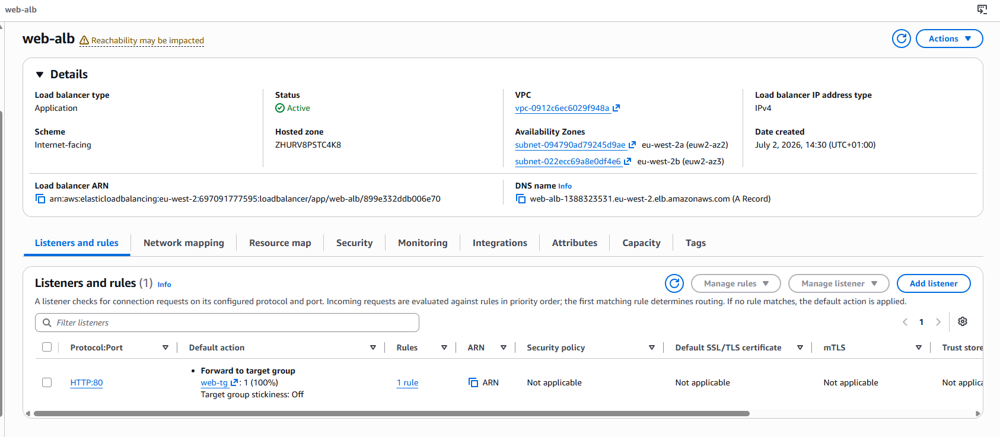
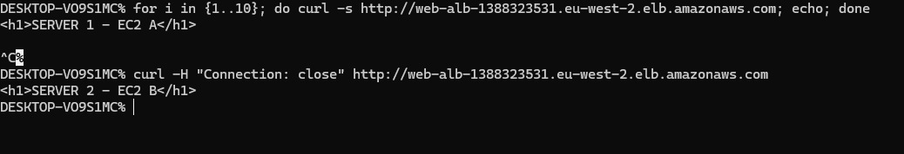
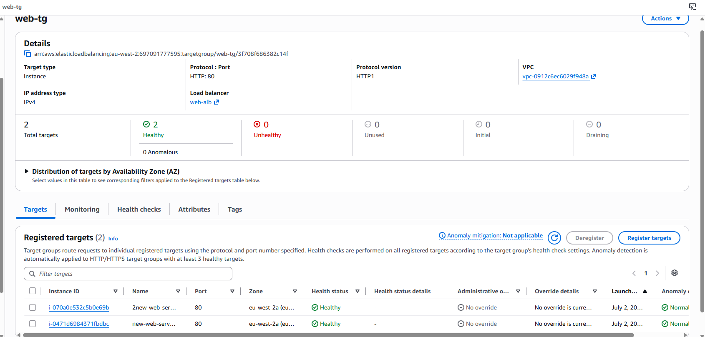
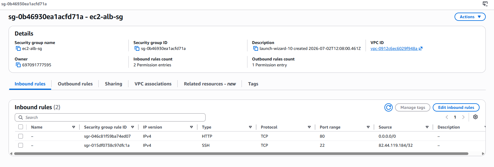
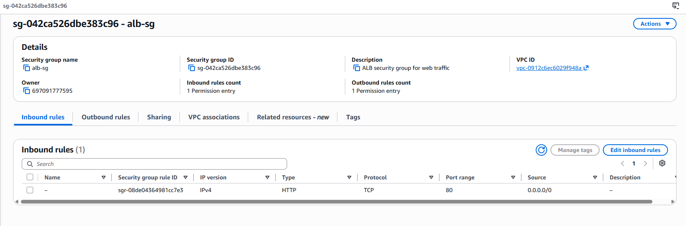

# AWS Application Load Balancer (ALB) High Availability Web Application

## Project Overview

In this project, I deployed a highly available web application architecture using two EC2 instances behind an Application Load Balancer (ALB).

The ALB acts as the single entry point for incoming traffic and distributes requests across registered EC2 instances while using health checks to ensure traffic is only sent to healthy targets.

The goal of this project was to understand:

- Load balancing
- Target groups and health checks
- Security group layering
- Multi-AZ architecture
- AWS networking fundamentals


# Architecture
Internet
|
|
Application Load Balancer (ALB)
|
|
Target Group
(Health Checks)
|
|----------------|
| |
EC2 Server 1 EC2 Server 2
SERVER 1 SERVER 2


# Step 1: EC2 Deployment

- Created two EC2 instances inside the same VPC
- Installed Apache web server using user-data scripts
- Configured different HTML responses on each instance for testing
- Verified both EC2 instances independently using their public IP addresses


## EC2 Server 1


## EC2 Server 2


# Step 2: Application Load Balancer Setup

Created an internet-facing Application Load Balancer to act as the entry point for user traffic.

Configuration:

- ALB deployed across two public subnets
- HTTP listener configured on port 80
- ALB connected to target group
- Traffic forwarded to healthy EC2 instances


## ALB Configuration




## ALB Active Status




# Step 3: Target Group & Health Checks

Created a target group to manage backend EC2 instances.

Configuration:

- Protocol: HTTP
- Port: 80
- Health check path: `/`
- Registered both EC2 instances

The target group verifies instance health before allowing traffic.


## Target Group Health




# Step 4: Security Groups

Security groups were configured to control traffic between the ALB and EC2 instances.


## ALB Security Group

Allows:

- HTTP traffic (port 80)
- Incoming traffic from the internet





## EC2 Security Group

Allows:

- HTTP traffic only from the ALB security group

This prevents direct public access to EC2 instances.





# Step 5: Testing & Validation

The application was tested using WSL terminal with curl.

Example:

```bash
curl http://<ALB-DNS>
SERVER 1 - EC2 A
SERVER 2 - EC2 B

Key Learnings

Through this project I learned:

How Application Load Balancers distribute traffic across multiple EC2 instances
How target groups use health checks to identify healthy servers
The importance of security group layering between ALB and EC2
How multi-AZ architecture improves availability
The fundamentals of scalable AWS architecture design
Key Takeaway

An Application Load Balancer improves availability and scalability by distributing traffic across multiple EC2 instances while ensuring only healthy targets receive requests.
