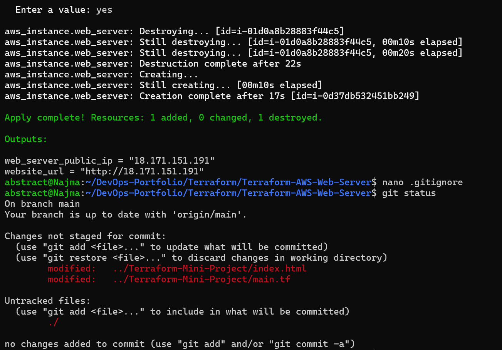
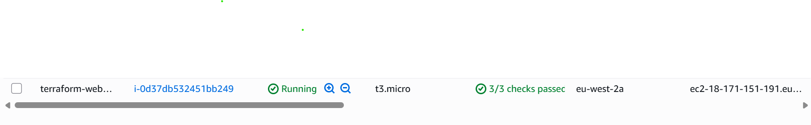
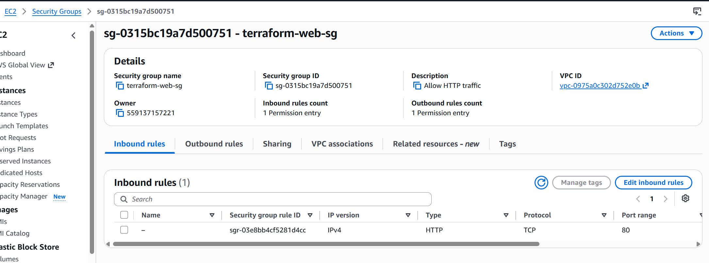
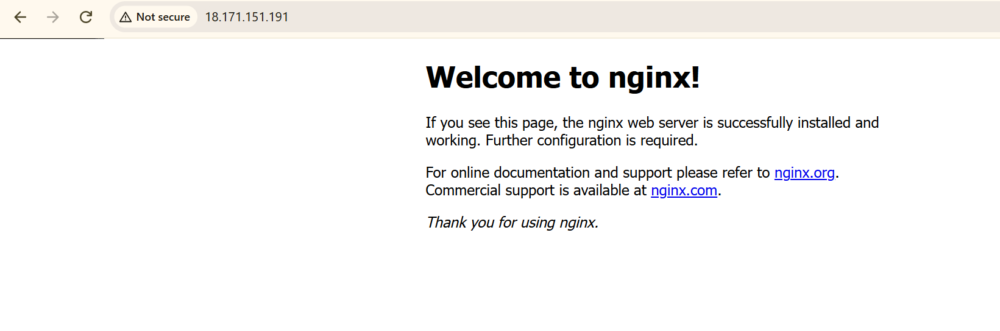
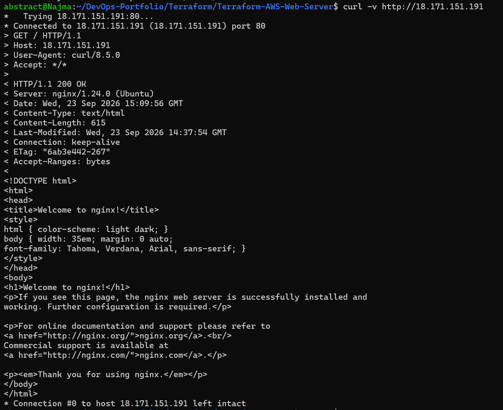

# Terraform AWS Web Server

A small Terraform project that deploys a working NGINX web server on AWS.

## Architecture

Terraform provisions:

- AWS provider in the London region (`eu-west-2`)
- Security Group allowing HTTP traffic on port 80
- Ubuntu EC2 instance
- NGINX installed automatically using EC2 User Data
- Terraform outputs for the public IP address and website URL

## How It Works

Terraform looks up a recent Ubuntu AMI and creates an EC2 instance using it.

A Security Group acts as the firewall and allows HTTP traffic on port 80.

When the EC2 instance launches, User Data automatically:

1. Updates the package list
2. Installs NGINX
3. Enables NGINX
4. Starts the NGINX service

The NGINX webpage can then be accessed using the EC2 public IP address.

## Terraform Commands

```bash
terraform init
terraform fmt
terraform validate
terraform plan
terraform apply


## Project Evidence

### Terraform Deployment
Terraform successfully provisioned the AWS infrastructure.



### EC2 Instance Running
The EC2 web server is running successfully in AWS.



### Security Group
The Security Group allows HTTP traffic over TCP port 80.



### NGINX Web Server
NGINX was automatically installed using EC2 User Data and is accessible through the EC2 public IP.



### HTTP Test
`curl` confirmed that the web server responds successfully with **HTTP 200 OK**.




## What I learned:

This project was my first hands-on experience using Terraform with AWS to create an EC2 instance running an NGINX web server. 
I learned how Terraform can provision AWS infrastructure, including an EC2 instance, a Security Group as a firewall, an AMI and User Data.
Most importantly, this project showed me the power of Terraform and taught me a key rule: always review terraform plan carefully before
applying any changes.
